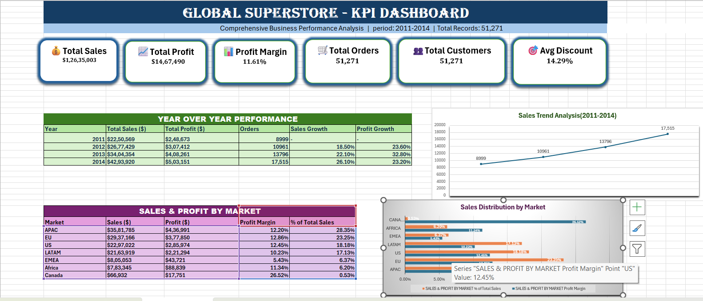
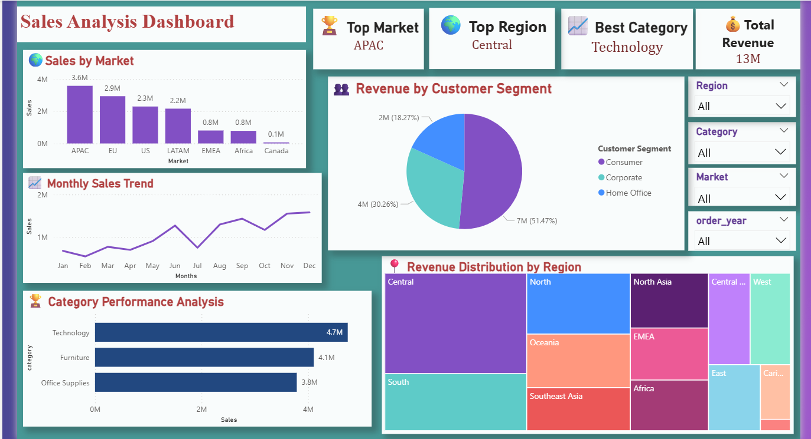
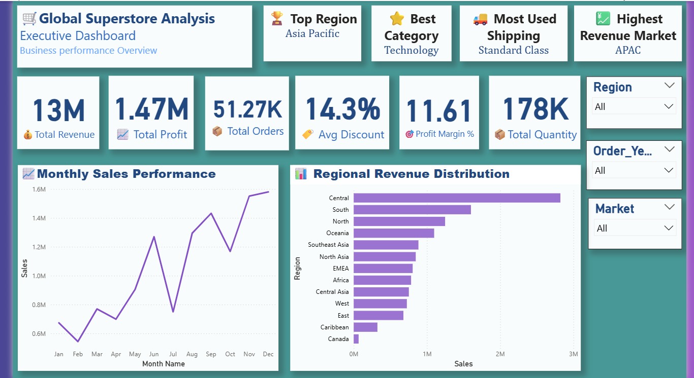
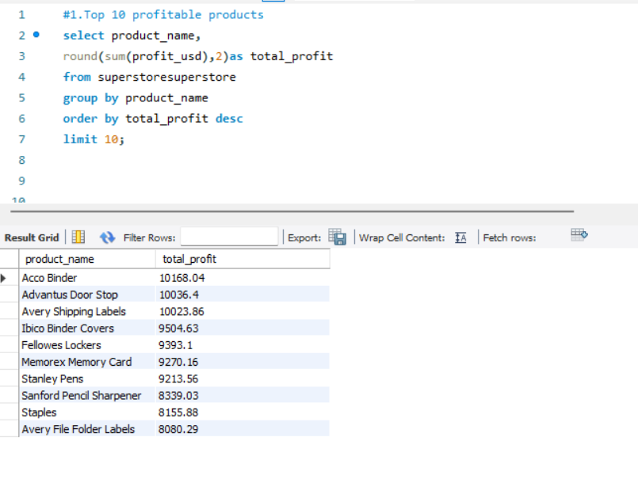

# 📊 Ecommerce Sales Analysis Dashboard

## 📌 Project Overview

The Ecommerce Sales Analysis Dashboard is a comprehensive Data Analytics project developed using Microsoft Excel, SQL, and Power BI. This project focuses on analyzing ecommerce sales data to uncover meaningful business insights, identify sales trends, evaluate profit performance, and support data-driven decision-making through interactive dashboards and visual reports.

---

## 🎯 Project Objectives

- Analyze overall sales and profit performance.
- Identify top-performing products and categories.
- Compare regional sales performance.
- Monitor key business KPIs.
- Discover sales trends and customer purchasing patterns.
- Generate business insights through data visualization.

---

## 🛠️ Tools Used

### 📗 Microsoft Excel
- Data Cleaning and Preprocessing
- Pivot Tables
- Pivot Charts
- KPI Dashboard Creation
- Interactive Excel Dashboard

### 🗄️ SQL
- Data Extraction
- Data Filtering
- Aggregation
- Business Analysis Queries
- GROUP BY, ORDER BY, WHERE, JOIN, Aggregate Functions

### 📊 Power BI
- Interactive Dashboard
- Data Visualization
- KPI Cards
- Business Reports
- Insightful Charts

---

## 📈 Key Performance Indicators (KPIs)

- Total Sales
- Total Profit
- Total Orders
- Sales by Region
- Category-wise Sales
- Profit Analysis
- Sales Trend Analysis

---

## 💡 Business Insights

This project provides valuable business insights, including:

- Top-performing products
- High-profit categories
- Regional sales comparison
- Customer purchasing behavior
- Sales growth trends
- Profit optimization opportunities

---

## 📂 Project Files

| File | Description |
|------|-------------|
| Dataset.csv | Cleaned dataset used for analysis |
| Ecommerce_Sales_Dashboard.xlsx | Excel dashboard with Pivot Tables, KPIs, and Charts |
| SQL_Queries.sql | SQL queries used for business analysis |
| PowerBI_Dashboard.pbix | Interactive Power BI dashboard |
| Business_Insights.pdf | Summary of key business insights and findings |

---

## 🖼️ Dashboard Preview

### Excel Dashboard

### Power BI Dashboard

### Power BI Dashboard 2

### SQL Query Output

---

## 🚀 Skills Demonstrated

- Data Cleaning
- Data Analysis
- Microsoft Excel
- SQL
- Power BI
- Data Visualization
- KPI Dashboard Development
- Business Intelligence
- Business Insights
- Analytical Thinking
- Problem Solving

---

## 👩‍💻 Author

**Kumari Duvvarapu**

Aspiring Data Analyst passionate about transforming raw data into meaningful business insights using Excel, SQL, and Power BI.

-----

⭐ If you found this project useful, feel free to explore the repository.
